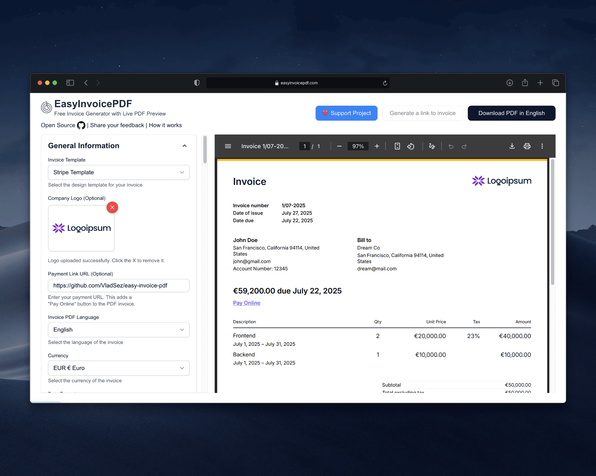
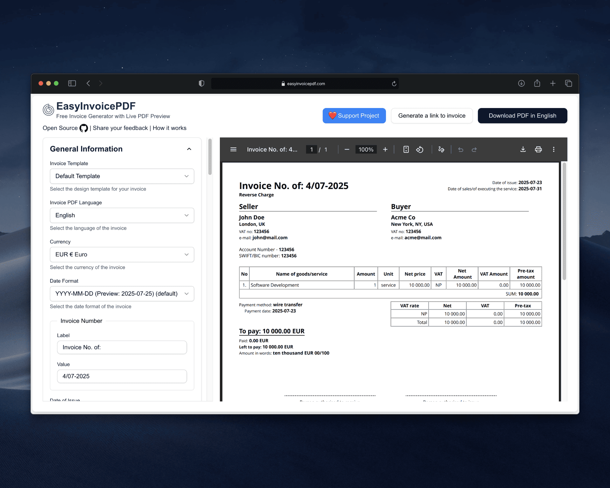

  <h3 align="center" style="font-size: 2rem;"><a href="https://easyinvoicepdf.com/?template=stripe&ref=github">EasyInvoicePDF</a></h3>
  
  

       Free & Open-Source Invoice Generator
     
     
    <a href="https://easyinvoicepdf.com/?template=stripe&ref=github">App</a>
    ·
    <a href="https://easyinvoicepdf.com/en/about?ref=github">Landing Page</a>
    ·
    <a href="https://github.com/VladSez/easy-invoice-pdf/releases">Releases</a>
  

  

## Introduction

**EasyInvoicePDF** is a Free & Open-Source Invoice Generator. Create professional invoices instantly in your browser with **Live Preview**, **Multiple Templates** (including a Stripe-style design). **No Sign-Up Required**.

Visit the app website at [EasyInvoicePDF.com](https://easyinvoicepdf.com/?template=stripe&ref=github)

## ✨ Key Features

- ⭐ **No Sign-Up Required**: Start creating invoices immediately without any registration
- 📄 **Instant PDF**: One-click download ready for printing or sending
- ⚡ **Live Preview**: See changes in real-time as you type
- 🔗 **Shareable Links**: Send invoices directly to clients without attachments
- 🎨 **Multiple Templates**: Including modern **Stripe-style design**
- 📱 **Browser Only**: No server uploads, your data stays private
- 💰 **Flexible Tax Support**: VAT, GST, Sales Tax, and custom tax formats with automatic calculations
- 🌍 **Multi-Language**: Support for 10+ languages and all major currencies
- 📱 **Mobile-Friendly**: Create invoices on the go from any device

## 🎥 Demo Video

Watch a quick demo of EasyInvoicePDF in action to see how easy it is to create professional invoices in seconds. The video demonstrates key features like **Live Preview**, **Instant PDF Download**, and **Customization Options**.

https://github.com/user-attachments/assets/9e3194e0-3072-4c95-ae99-e66db1301dc6

## ❤️ Support the Project

If you find EasyInvoicePDF useful, please consider:

- ⭐ **Star this repository** on GitHub to show your support
- ☕ [Buy me a coffee](https://buymeacoffee.com/vladsazon) to support the [creator](https://vladsazon.com)

Your support helps keep this project free and open-source 🙏

## Tech Stack

- [React](https://react.dev/)
- [TypeScript](https://www.typescriptlang.org/)
- [Next.js](https://nextjs.org/)
- [TailwindCSS](https://tailwindcss.com/)
- [shadcn/ui](https://ui.shadcn.com/)
- [Origin UI](https://originui.com/)
- [@react-pdf/renderer](https://github.com/diegomura/react-pdf)

## Other Tools & Services

- Generate beautiful OG images: https://og.new
- Analytics: https://umami.is/
- [typescript-plugin-directives](https://www.npmjs.com/package/typescript-plugin-directives)
- [Create Mockups with shots.so](https://shots.so/)

## Quick Start

- Run `pnpm i`
- Copy `.env.example to .env.local` (`cp .env.example .env.local`)
- Run `pnpm run dev`

For the full app experience, you’ll need to obtain and set values from the following services:

- [Resend](https://resend.com/)
- [Upstash](https://upstash.com/)
- [Google Drive API](https://developers.google.com/workspace/drive/api/quickstart/js)
- [Telegram Bot API](https://core.telegram.org/bots)

## License

This project is dual-licensed:

- **AGPL-3.0** (for open-source or compliant use): [GNU AGPL v3](https://www.gnu.org/licenses/agpl-3.0.html)
- **Commercial license** (for proprietary use): contact [vlad@mail.easyinvoicepdf.com](mailto:vlad@mail.easyinvoicepdf.com)

By using this software, you agree to the terms of the applicable license.

## 👨‍💻 Made By

Created and maintained by [Vlad Sazon](https://vladsazon.com)

- 🐦 Twitter: [@vladsazonau](https://twitter.com/vladsazonau)
- 💼 LinkedIn: [Vlad Sazon](https://www.linkedin.com/in/vlad-sazonau-22a9a9126/)
- 🌐 Website: [vladsazon.com](https://vladsazon.com)
