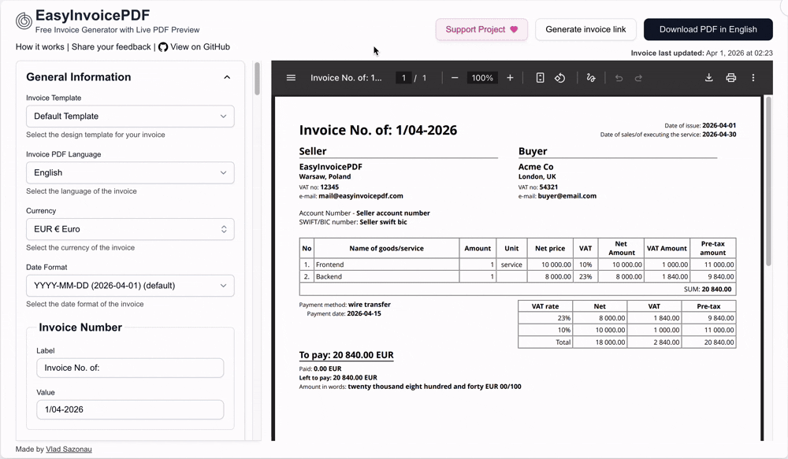
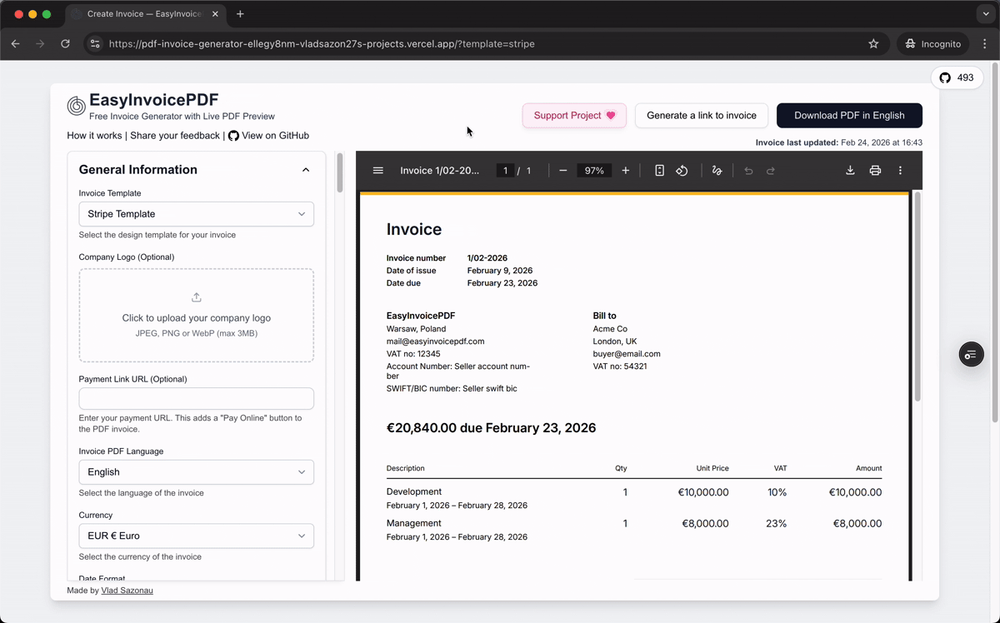
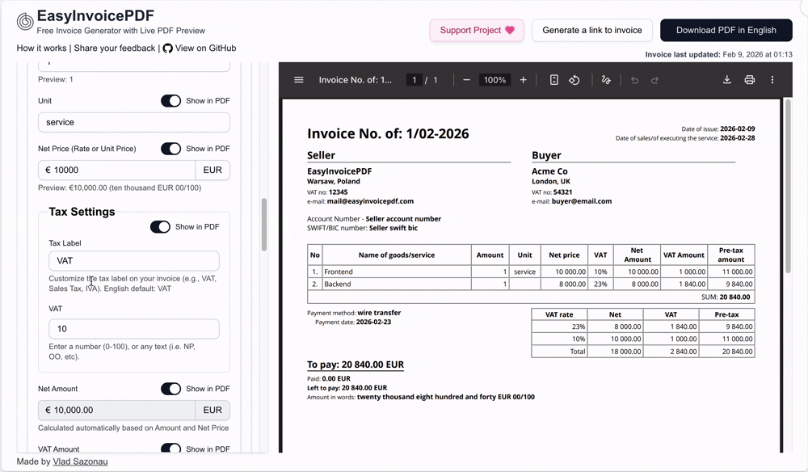

  
  <h1>EasyInvoicePDF</h1>
  <h3>Free & Open-Source Invoice Generator</h3>
  
Create professional invoices instantly in your browser with <strong>Live Preview</strong>, <strong>Multiple Templates</strong> (including a Stripe-style design). <strong>No Sign-Up Required</strong>.

  
<a href="https://easyinvoicepdf.com/?template=stripe&ref=github"><strong>Get Started</strong></a>

  

      <a href="https://easyinvoicepdf.com/en/about?ref=github">About</a>
      ·
      <a href="https://github.com/VladSez/easy-invoice-pdf/releases">Releases</a>
    

  

## ✨ Key Features of EasyInvoicePDF:

- ⭐ **No Sign-Up Required**: Start creating invoices immediately without any registration
- 📄 **Instant PDF**: One-click download ready for printing or sending
- ⚡ **Live Preview**: See changes in real-time as you type
- 🔗 **Shareable Links**: Send invoices directly to clients without attachments
- 🎨 **Multiple Templates**: Including modern **Stripe-style design**
- 📱 **Browser Only**: No server uploads, your data stays private
- 💰 **Flexible Tax Support**: VAT, GST, Sales Tax, and custom tax formats with automatic calculations
- 🌍 **Multi-Language & Currency**: Support for 10+ languages and 120+ currencies
- 📱 **Mobile-Friendly**: Create invoices on the go from any device
- 🏞️ **QR Code Support**: Add payment QR codes with any invoice-related information (payment links, UPI, contact details, custom data)
- 📑 **Multi-Page PDFs**: Seamless multi-page support with automatic pagination and page breaks

<h4>Learn more about <a href="https://easyinvoicepdf.com/en/about#features">features</a>.</h4>

---

### 🎬 Invoice PDF Live Preview

_See changes in **real-time** as you type_

---

### 📥 Instant PDF Download

_**One-click PDF download** ready for printing or sending_

---

### 🔗 Shareable Links

_**Send invoices directly to clients** without attachments_

---

### 📲 QR Codes & Advanced Multi-Page PDF Support

_**Add payment QR codes** with any invoice-related information (payment links, UPI, contact details, custom data) and **seamless multi-page support** with automatic pagination and page breaks for large invoices_

---

### 🏷️ Customizable Tax Settings

_**Customize tax labels** (VAT, Sales Tax, IVA, etc.)_

---

### 🌍 Language & Currency

_**Switch between 10 languages and 120+ currencies instantly** with live PDF preview updates_

---

### 🎨 Professional Invoice Templates

_**Choose between multiple professional templates** (Default and Stripe) to match your brand and style_

|                                           Default Invoice Template                                            |                                           Stripe Invoice Template                                           |
| :-----------------------------------------------------------------------------------------------------------: | :---------------------------------------------------------------------------------------------------------: |
|  |  |

## 📢 News & Updates

- **Jan 11, 2026**: Added customizable tax/VAT labels, improved internationalization (i18n) translations, enhanced overall performance, and fixed multiple bugs. [Release notes for v1.0.1](https://github.com/VladSez/easy-invoice-pdf/releases/tag/EasyInvoicePDF-1.0.1)
- **Nov 19, 2025**: EasyInvoicePDF version 1.0.0 released! Create professional invoices in seconds. Welcome to try EasyInvoicePDF. [Release notes for v1.0.0](https://github.com/VladSez/easy-invoice-pdf/releases/tag/EasyInvoicePDF-v1.0.0)

## 🎥 Demo Video

Watch a quick demo of EasyInvoicePDF in action to see how easy it is to create professional invoices in seconds. The video demonstrates key features like **Live Preview**, **Instant PDF Download**, and **Customization Options**.

https://github.com/user-attachments/assets/d46c6e4e-b78a-4aa1-ab44-d20d6485b682

## 👨‍💻 Made By

Built by [Vlad Sazonau](https://x.com/vladsazonau)

- 🐦 Twitter: [@vladsazonau](https://twitter.com/vladsazonau)
- 💼 LinkedIn: [Vlad Sazonau](https://www.linkedin.com/in/vlad-sazonau-22a9a9126/)
- 🌐 Website: [vladsazon.com](https://vladsazon.com)

## ❤️ Support the Project

If you find EasyInvoicePDF useful, please consider:

- ⭐ **Star this repository** on GitHub to show your support
- ☕ [Buy me a coffee](https://buymeacoffee.com/vladsazon) to support the [creator](https://vladsazon.com)

Your support helps keep this project free and open-source 🙏

**Join our community** [X.com](https://x.com/EasyInvoicePDF)

## Tech Stack

- [React](https://react.dev/)
- [TypeScript](https://www.typescriptlang.org/)
- [Next.js](https://nextjs.org/)
- [TailwindCSS](https://tailwindcss.com/)
- [shadcn/ui](https://ui.shadcn.com/)
- [Origin UI](https://originui.com/)
- [@react-pdf/renderer](https://github.com/diegomura/react-pdf)

## Other Tools & Services

- Generate beautiful OG images: https://og.new
- Analytics: https://umami.is/
- [typescript-plugin-directives](https://www.npmjs.com/package/typescript-plugin-directives)
- [Create Mockups with shots.so](https://shots.so/)

## Quick Start

- Run `pnpm i`
- Copy `.env.example to .env.local` (`cp .env.example .env.local`)
- Run `pnpm run dev`

For the full app experience, you’ll need to obtain and set values from the following services:

- [Resend](https://resend.com/)
- [Upstash](https://upstash.com/)
- [Google Drive API](https://developers.google.com/workspace/drive/api/quickstart/js)
- [Telegram Bot API](https://core.telegram.org/bots)

## License

This project is dual-licensed:

- **AGPL-3.0** (for open-source or compliant use): [GNU AGPL v3](https://www.gnu.org/licenses/agpl-3.0.html)
- **Commercial license** (for proprietary use): contact [vlad@mail.easyinvoicepdf.com](mailto:vlad@mail.easyinvoicepdf.com)

By using this software, you agree to the terms of the applicable license.
