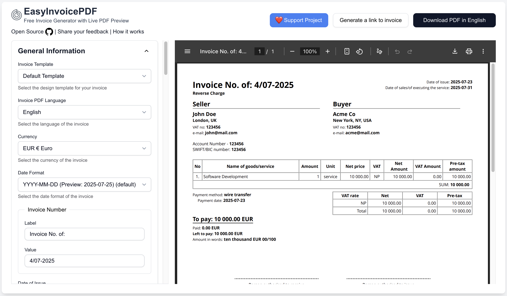
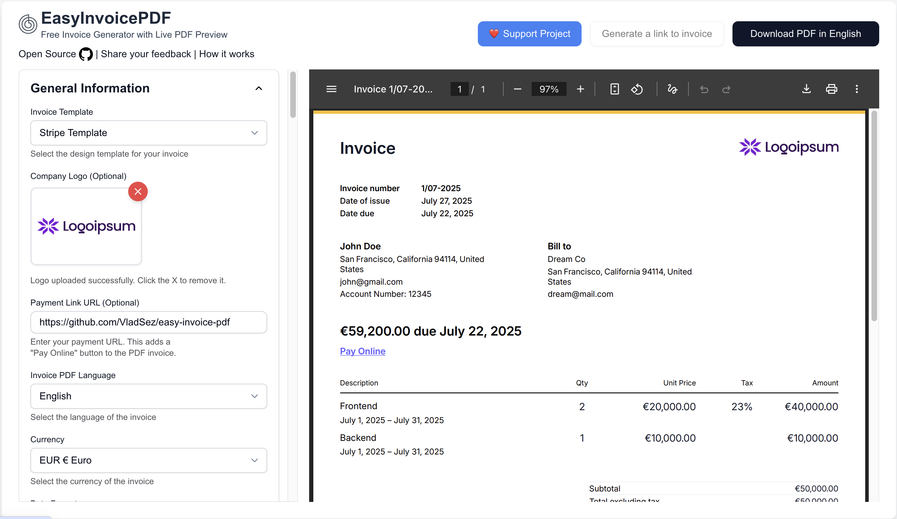

# 🧾 [EasyInvoicePDF](https://easyinvoicepdf.com)

> Free & Open-Source Invoice Generator. Create professional invoices instantly in your browser with **live preview**, **multiple templates**, and **no sign-up required**. **[Try it now → easyinvoicepdf.com](https://easyinvoicepdf.com)**

**🌐 [Discover more features and use cases → easyinvoicepdf.com/en/about](https://easyinvoicepdf.com/en/about)**

## Features

- ⚡ **Live Preview**: See changes in real-time as you type
- 🔗 **Shareable Links**: Send invoices directly to clients without attachments
- ⭐ **No Sign-Up Required**: Start creating invoices immediately without any registration
- 📱 **Browser Only**: No server uploads, your data stays private
- 🌍 **Multi-Language**: Support for 10+ languages and all major currencies
- 🧮 **European VAT**: Automatic VAT calculation and formatting
- 🎨 **Multiple Templates**: Including modern **Stripe-style design**
- 📄 **Instant PDF**: One-click download ready for printing or sending
- 📱 **Mobile-Friendly**: Fully responsive design works perfectly on all devices

**❤️ Support the project**: [Buy me a coffee](https://buymeacoffee.com/vladsazon) to help keep EasyInvoicePDF free and open-source!

#### Default Invoice Template

#### Stripe Invoice Template

#### Stripe Invoice Template with Logo

## Demo Video 🎥

Watch a quick demo of EasyInvoicePDF in action to see how easy it is to create professional invoices in seconds. The video demonstrates key features like live preview, instant PDF download, and customization options.

https://github.com/user-attachments/assets/9e3194e0-3072-4c95-ae99-e66db1301dc6

## Tech Stack

- [React](https://react.dev/)
- [TypeScript](https://www.typescriptlang.org/)
- [Next.js](https://nextjs.org/)
- [TailwindCSS](https://tailwindcss.com/)
- [shadcn/ui](https://ui.shadcn.com/)
- [Origin UI](https://originui.com/)
- [@react-pdf/renderer](https://github.com/diegomura/react-pdf)

## Other Tools & Services

- Generate beautiful OG images: https://og.new
- Analytics: https://umami.is/

## Quick Start

- Run `pnpm i`
- Copy `.env.example to .env.local` (`cp .env.example .env.local`)
- Run `pnpm run dev`

For the full app experience, you’ll need to obtain and set values from the following services:

- [Resend](https://resend.com/)
- [Upstash](https://upstash.com/)
- [Google Drive API](https://developers.google.com/workspace/drive/api/quickstart/js)
- [Telegram Bot API](https://core.telegram.org/bots)

## License

This project is dual-licensed:

- **AGPL-3.0** (for open-source or compliant use): [GNU AGPL v3](https://www.gnu.org/licenses/agpl-3.0.html)
- **Commercial license** (for proprietary use): contact [vlad@mail.easyinvoicepdf.com](mailto:vlad@mail.easyinvoicepdf.com)

By using this software, you agree to the terms of the applicable license.
